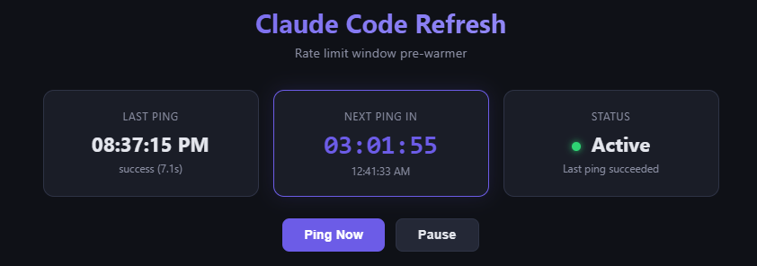

# Claude Code Refresh

Cut your Claude Code rate limit wait time from hours to minutes.



## The Problem

Claude Code (Pro and Max plans) has a rate limit based on a **4-hour rolling window**. The window starts from your **first request**.

Here's what happens without this tool:

- You arrive at **9:00 AM** and start coding with Claude
- By **10:00 AM** you've used up your limit
- The window started at 9:00, so it resets at **1:00 PM**
- You wait **4 hours** doing nothing

## The Solution

This tool sends a tiny ping (`claude -p hi`) every ~4 hours in the background. That starts the rolling window early — before you even sit down to work.

Here's what happens with this tool:

- The tool pings Claude at **6:44 AM** while you're still asleep
- You arrive at **9:00 AM** and start coding
- By **10:00 AM** you've used up your limit
- But the window started at 6:44, so it resets at **10:44 AM**
- You wait **44 minutes** instead of 4 hours

The ping costs almost nothing against your limit but shifts the entire window in your favor.

## Features

- **Web dashboard** with real-time status, countdown timer, and live terminal output
- **Flexible scheduling** — set a fixed interval (e.g. every 4h 5m) or specific times of day
- **Ping history** tracking with status and duration
- **Optional password protection** via environment variable
- **English / Hebrew UI**
- **Docker-ready** with persistent storage

## Run It Your Way

### Locally

```bash
npm install
npm start
```

Open `http://localhost:3000`

### Docker

```bash
docker build -t claude-code-refresh .
docker run -p 3000:3000 -v claude_data:/data claude-code-refresh
```

### Host It (Fly.io, Railway, any VPS)

Deploy the Docker image to any always-on platform. As long as it stays running, your rate limit window keeps rolling.

You'll need to authenticate Claude Code once:

```bash
# Docker
docker exec -it <container> claude login

# Fly.io
fly ssh console -C "claude login"
```

## Environment Variables

| Variable | Default | Description |
|----------|---------|-------------|
| `PORT` | `3000` | Server port |
| `DATA_DIR` | `./data` | Persistent data directory |
| `DASHBOARD_PASSWORD` | *(none)* | Set to enable login protection |

## Requirements

- Node.js 20+
- [Claude Code CLI](https://docs.anthropic.com/en/docs/claude-code) installed and authenticated
- A persistent volume for `/data` (stores config, history, and Claude credentials)
